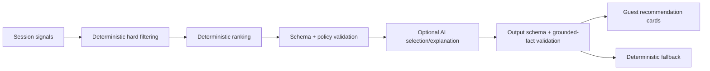

# AI Concierge Design

## 1. Role

AI improves explanation and conversational guidance. It is not the source of menu truth, a safety decision-maker, or an autonomous actor.

## 2. Allowed uses

- Briefly explain why validated items fit stated preferences
- Rephrase approved dish facts in the restaurant’s voice
- Answer bounded menu questions from approved structured data
- Offer a coherent, editable meal narrative from valid candidates
- Convert unresolved questions into structured server escalations

## 3. Prohibited uses

- Direct SpotOn/API/database mutation
- Price, availability, ingredient, allergen, preparation, or nutrition invention
- Medical/nutritional advice
- Claims that an item is safe
- Autonomous web browsing or tools
- Hidden upsell or misleading personalization claims
- Free-text instructions controlling system prompts or trusted data

## 4. Recommendation pipeline



### Priority order

1. Allergies and hard dietary constraints
2. Availability and valid modifiers
3. Guest intent/preferences/budget
4. Meal coherence and variety
5. Popularity and approved operational signals
6. Promotions and margin

Managers cannot override the first four priorities.

## 5. Inputs

Allowed:

- Current published menu snapshot
- Approved ingredients/allergens/dietary tags
- Current availability and SpotOn prices
- Dining intent, party size, optional budget
- Session-only diner preferences/rejections
- Approved pairings and chef templates
- Anonymized, thresholded location trends
- Verified promotions

Excluded:

- Direct identifiers
- Payment/card data
- SpotOn credentials
- Raw audit/security logs
- Unnecessary conversation history
- Internal staff notes

## 6. Structured response

AI output must conform to a strict server-validated schema such as:

```json
{
  "recommendations": [
    {
      "menuItemId": "internal-id",
      "reasonCodes": ["PREFERENCE_MATCH", "APPROVED_PAIRING"],
      "explanation": "A concise grounded explanation."
    }
  ],
  "needsServer": false
}
```

Every `menuItemId` must already exist in the validated candidate set. Reason codes are generated or confirmed deterministically.

## 7. Fallback

- Two-second AI deadline
- Invalid schema or unsafe content is discarded completely
- Use manager-approved pairings, intent templates, and popular valid items
- Menu browsing, cart, service requests, and ordering never depend on AI

## 8. Menu Q&A

If approved facts answer the question, respond concisely and cite the verified fields in the internal trace.

If not:

- State that the information is not verified.
- Offer to contact the server.
- Send the item/question context as a structured escalation.
- Never fill gaps with general culinary knowledge when safety, ingredients, preparation, price, or availability is involved.

## 9. Promotions and transparency

- Label restaurant promotions as `Featured tonight`, `Chef's special`, or approved equivalent.
- Do not claim promoted items are uniquely personal or organically popular.
- Recommendation explanations may mention verified preference, intent, pairing, popularity, or budget fit.
- Do not expose internal margin values.

## 10. Data handling

- Use API terms/settings that do not train general models on restaurant/guest data.
- Send minimum redacted context.
- No permanent transcript storage by default.
- Persist structured outcomes, recommendation impressions/acceptance, safety events, and escalation reasons.
- Redacted diagnostic transcripts require manager authorization and expire within seven days.

## 11. Evaluation and release

Prompt/model changes are versioned like code and tested against:

- Normal menu discovery
- Allergies and cross-contact
- Unknown facts
- Invalid/off-menu requests
- Prompt injection
- Conflicting preferences
- Sold-out/changed-price items
- Promotion disclosure
- Latency/fallback
- Schema failure

Production changes require staging review, feature flags, rollback, and the normal technical/operational approvals. Food-safety behavior also requires Anusha’s approval.

## 12. Learning and experiments

- Acceptance/rejection data may inform offline ranking evaluation.
- Production behavior never self-updates.
- Minimum samples, safety checks, and approved deployment are required.
- A/B tests are limited to low-risk presentation/ranking.
- Never experiment with allergens, disclosures, prices, authorization, order validation, or escalation.

