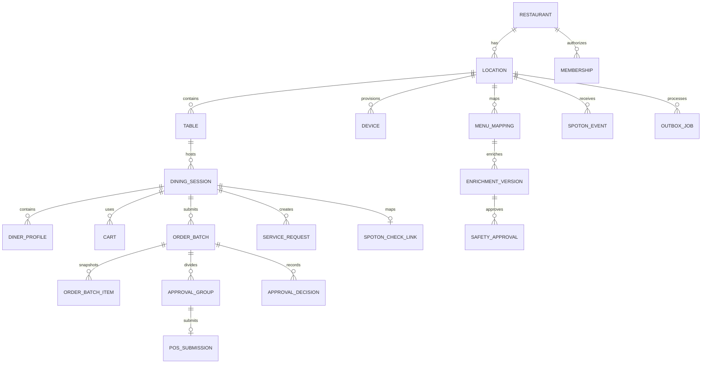

# Domain Model

## 1. Aggregate boundaries

### Restaurant

Owns tenant-level branding, policies, memberships, and locations.

### Location

Owns timezone, currency, operating configuration, SpotOn authorization, request rules, tables, menu publication, and feature flags.

### Device

Represents a revocable guest-tablet identity. A device is provisioned to one location and default table. It is not a user account.

### DiningSession

Owns one seated visit:

- Table assignment
- Assigned server
- Lifecycle and pause state
- Temporary diner profiles
- Allergy disclosure status
- SpotOn check link
- Ordering-open/check-requested state

One active session maps to at most one SpotOn check in MVP.

### MenuItemEnrichment

Versioned AETHER content mapped to a SpotOn item:

- Description and approved restaurant wording
- Images
- Ingredients
- Allergen classifications
- Dietary tags
- Spice guidance
- Pairings
- Recommendation metadata
- Review and publication state

Transactional values are referenced from SpotOn snapshots, not authored here.

### Cart

Mutable session workspace. It is not an audit record or approved order.

### OrderBatch

Immutable submitted intent. A revision creates a new version linked to its predecessor.

### ApprovalGroup

Subset of a batch that can progress independently, such as food and alcohol.

### PosSubmission

Durable provider-operation record with one immutable idempotency key, attempts, acknowledgments, ambiguity state, and provider references.

### ServiceRequest

Independent hospitality workflow with ownership, escalation, and completion.

## 2. Conceptual entity relationship model

## 3. Core records

Every tenant-owned record includes `restaurant_id`; operational records also include `location_id` where applicable.

### Identity and tenancy

- `restaurants`
- `locations`
- `users`
- `memberships`
- `role_assignments`
- `support_sessions`

### Devices and sessions

- `tables`
- `devices`
- `device_credentials`
- `dining_sessions`
- `session_assignments`
- `diner_profiles`
- `session_preferences`
- `session_allergens`

### Menu

- `spoton_menu_snapshots`
- `menu_mappings`
- `menu_item_enrichment_versions`
- `ingredient_records`
- `allergen_assessments`
- `dietary_claims`
- `menu_approvals`
- `menu_publications`
- `media_assets`
- `pairing_rules`
- `dining_intents`
- `promotion_presentations`

### Ordering

- `carts`
- `cart_items`
- `order_batches`
- `order_batch_items`
- `approval_groups`
- `approval_decisions`
- `pos_submissions`
- `pos_submission_attempts`
- `spoton_check_links`

### Hospitality

- `service_request_types`
- `service_requests`
- `request_transitions`
- `feedback`
- `feedback_tags`
- `staff_sections`
- `table_assignments`

### Platform operations

- `outbox_jobs`
- `dead_letter_jobs`
- `spoton_events`
- `sync_cursors`
- `feature_flags`
- `audit_events`
- `analytics_events`
- `incident_records`

## 4. Required invariants

- At most one active dining session per table.
- At most one active session per guest device.
- A submitted batch version cannot be edited.
- A server cannot approve an unseen batch revision.
- A SpotOn operation has one immutable idempotency key.
- An ambiguous POS submission cannot be resubmitted automatically.
- A session cannot close with unresolved submissions or active requests without manager override.
- A published menu item has a valid current SpotOn mapping.
- Authors cannot approve their own safety-related changes.
- Allergy-sensitive ordering cannot proceed with unknown item/modifier safety data.
- Client-provided `restaurant_id` or `location_id` never grants scope.

## 5. Money and time

- Store money as integer minor units plus ISO currency.
- Currency and display timezone are location-scoped.
- Store timestamps in UTC.
- Historical item snapshots retain names, prices, currency, modifiers, and menu version.

## 6. Order item snapshot

Each submitted line captures:

- SpotOn item and modifier identifiers
- Display names
- Quantity
- Quoted unit/extended prices
- Currency
- Complete modifier selections
- Diner/seat assignment
- Shared-item participants
- Structured preparation choices
- Server-reviewed guest note
- Relevant allergen flags
- Menu version
- Availability/price validation timestamp

## 7. Deletion and retention

- Never hard-delete referenced historical orders.
- Archived SpotOn items retain enrichment and analytics.
- Session-specific guest data is cleared on closure.
- Audit/security/order-change logs: one year.
- Anonymized analytics: two years.
- Authorized redacted diagnostics: maximum seven days.
- Tenant offboarding: export, 30-day recovery window, then verified deletion subject to legal obligations.

