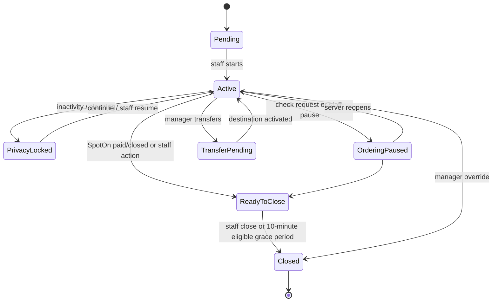
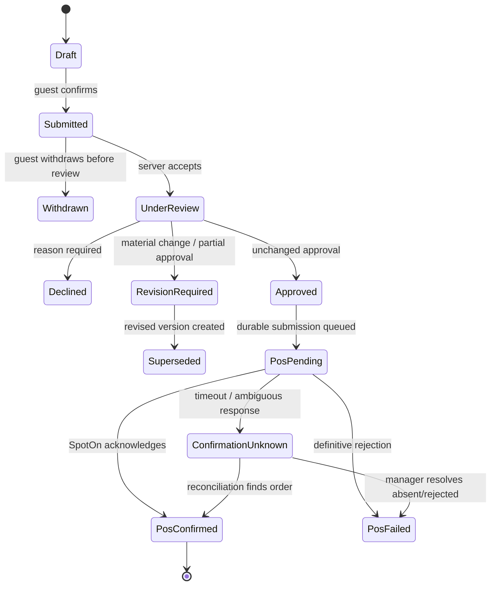
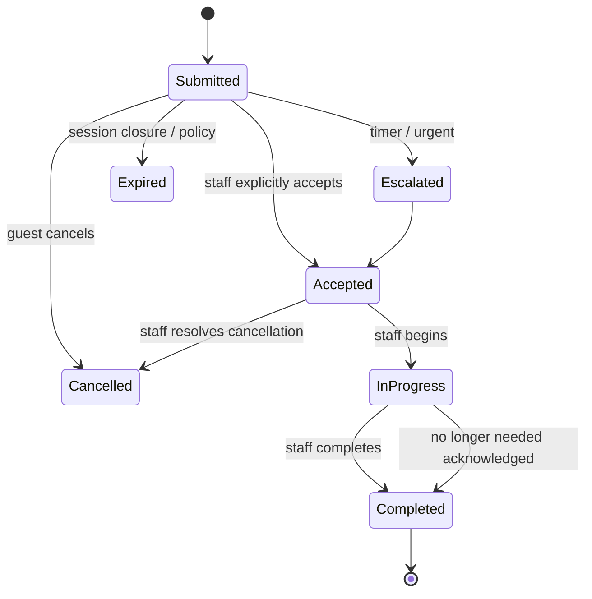

# State Machines

Generic status patching is prohibited. Each transition is an intent-specific command validated atomically.

## 1. Dining session



Closure blocks on unresolved POS submissions and active requests unless a manager supplies an audited reason.

## 2. Order batch



`Submitted` and later versions are immutable. A revision is a new batch record.

## 3. Approval group

Food and alcohol may progress separately. Each group uses:

```text
pending → under_review → awaiting_guest_confirmation → approved
       ↘ declined
approved → pos_pending → pos_confirmed | pos_failed | confirmation_unknown
```

Alcohol approval additionally requires authorized staff and session-level age-verification evidence without identity-document storage.

## 4. POS submission

| State | Meaning | Allowed next action |
|---|---|---|
| `created` | Persisted with idempotency key | Queue |
| `queued` | Awaiting worker | Claim |
| `sending` | Worker owns attempt | Record result |
| `retryable_failure` | Definitive transient failure | Retry same key |
| `confirmation_unknown` | Provider result ambiguous | Reconcile only |
| `confirmed` | SpotOn reference verified | Mirror status |
| `rejected` | Definitive provider rejection | Human resolution |
| `dead_letter` | Retry policy exhausted | Manager/operator resolution |

Never generate a replacement idempotency key for the same approved group.

## 5. Service request



Opening an alert is not acceptance. Duplicate active requests merge and increase urgency.

## 6. Menu enrichment

```text
draft → in_review → approved → published → archived
                    ↘ changes_requested
published → review_required
review_required → in_review
```

Safety-related changes require independent food-safety approval. Availability restriction can publish immediately. Rollback may restore a previously approved version only if its safety basis remains current.

## 7. Guest-facing derived status

Guest status is computed from separate AETHER approval, POS submission, and SpotOn states:

| Conditions | Guest wording |
|---|---|
| Awaiting server ownership | Sent to your server |
| Server reviewing | Your server is reviewing |
| Guest revision required | Please review these changes |
| POS pending | Confirming your order |
| POS confirmed, no reliable kitchen feed | Confirmed by your server |
| Reliable SpotOn preparation state | Being prepared |
| Reliable SpotOn ready state | Ready soon |
| Failure needing staff | Your server is checking this order |

No countdown or kitchen status is invented.

