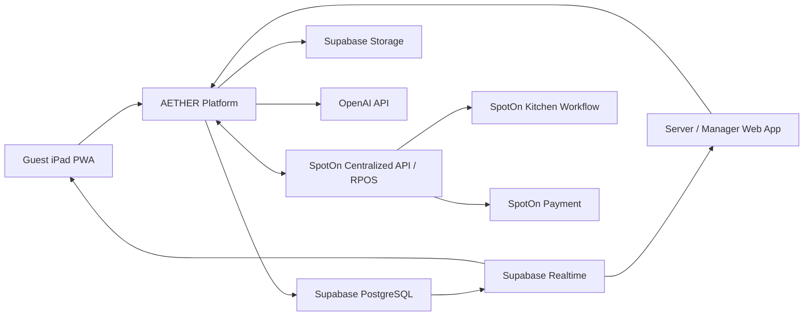

# System Architecture

## 1. Architecture style

The MVP is a modular monolith deployed through Next.js, with explicit domain modules and durable asynchronous processing in PostgreSQL. This minimizes operational complexity while preserving domain boundaries that can later be extracted if scale or isolation requires it.

## 2. Context

Realtime events are invalidation signals only. Clients refetch authoritative, tenant-scoped state.

## 3. Logical modules

| Module | Responsibility |
|---|---|
| Identity and tenancy | Auth, memberships, roles, restaurant/location scope |
| Device provisioning | Revocable device identity and table binding |
| Dining sessions | Start, transfer, pause, privacy lock, close |
| Menu sync | SpotOn import, availability, reconciliation, mappings |
| Menu enrichment | Versioned content, approvals, publication, rollback |
| Guest preferences | Temporary diners, intent, budget, preferences, allergies |
| Recommendations | Deterministic eligibility/ranking and bounded AI explanation |
| Cart | Mutable pre-submission selections and validation |
| Order workflow | Immutable batches, revisions, approval groups and decisions |
| POS integration | Outbox, idempotency, OAuth, webhooks, reconciliation |
| Service requests | Routing, ownership, escalation, completion |
| Staff operations | Sections, live floor, alerts, outage controls |
| Feedback | Ratings, tags, protected comments, recovery alerts |
| Analytics | Anonymized events, cohort thresholds, pilot metrics |
| Platform operations | Tenant provisioning, health, feature flags, support access |
| Audit | Append-only actor/action/correlation records |

Modules communicate through application-service interfaces and domain events, not direct cross-module table mutations.
The canonical code-directory mapping is maintained in the
[Engineering Guide](../engineering/development.md#2-repository-structure).

## 4. Deployment topology

### Production

- Vercel: Next.js application and server-side endpoints
- Supabase U.S. region: PostgreSQL, Auth, Realtime, Storage
- Supabase Edge Functions: outbox consumers and reconciliation workers
- Supabase Cron: 10-second critical recovery sweep and task-specific schedules
- OpenAI: bounded server-side structured calls
- SpotOn: OAuth-authorized RPOS integration per location
- MDM: kiosk, compliance, credential revocation, remote lock/wipe
- Monitoring: structured logs, metrics, traces, and alert routing

Development, staging, and production use fully isolated projects, credentials, webhooks, storage, domains, and data.
Worker runtime, concurrency, leases, retries, and failure ownership are defined
by [ADR 0011](../adr/0011-worker-runtime-and-scheduling.md).

## 5. Request boundaries

The guest PWA may:

- Fetch published, guest-scoped menu/session projections
- Subscribe to narrowly scoped realtime invalidation events
- Send commands through authenticated AETHER APIs

It may not:

- Access privileged tables directly
- Transition order state with generic updates
- Hold SpotOn/OpenAI/server credentials
- Call SpotOn or OpenAI directly

## 6. Durable integration pattern

Transactional command:

1. Validate tenant, role, session, state version, menu snapshot, and safety constraints.
2. Commit domain transition and outbox record in one database transaction.
3. Worker claims outbox job with locking.
4. Worker calls SpotOn using immutable idempotency/reference data.
5. Persist provider response and transition `PosSubmission`.
6. Publish a minimal domain notification.
7. Client refetches authoritative state.

Ambiguous results never trigger a new idempotency key.
An asynchronous post-commit wake-up minimizes dispatch latency. A scheduled
recovery sweep claims missed work, so correctness never depends on wake-up
delivery.

## 7. Data consistency

- PostgreSQL is authoritative for AETHER-owned workflow.
- SpotOn is authoritative for transactional menu facts and acknowledged orders/checks.
- Submitted order snapshots are immutable.
- Optimistic concurrency uses explicit versions and atomic transitions.
- Provider webhooks are persisted before asynchronous processing.
- Reconciliation repairs missed events and detects divergence.

## 8. Failure containment

| Failure | Required behavior |
|---|---|
| OpenAI unavailable/slow | Deterministic recommendations; ordering continues |
| Supabase/AETHER unavailable | SpotOn service continues; tablets stop submissions |
| SpotOn unavailable | Cached browsing; ordering unavailable; no hidden queue |
| Realtime unavailable | Poll/refetch fallback |
| Webhook delayed | Incremental polling and nightly reconciliation |
| Unknown submission result | Block resubmission; reconcile; manager resolution |
| Device compromised | Quarantine, revoke credential, lock/wipe |
| Capacity pressure | Preserve safety, service requests, and ordering; degrade AI/analytics/media |

## 9. Scalability target

Per location:

- 50 active tables
- 200 concurrent guest/staff clients
- Burst order submissions at peak

Use managed serverless-compatible connection pooling and per-location quotas for noncritical AI, uploads, and API traffic.

## 10. Future extraction signals

Do not introduce microservices merely for organization. Consider extraction only when:

- POS workers require independent scaling or isolation
- Analytics workloads materially affect operations
- Multi-region/data-residency constraints emerge
- A domain has clear ownership and independent release needs
- Measured load exceeds the modular monolith’s operational envelope
