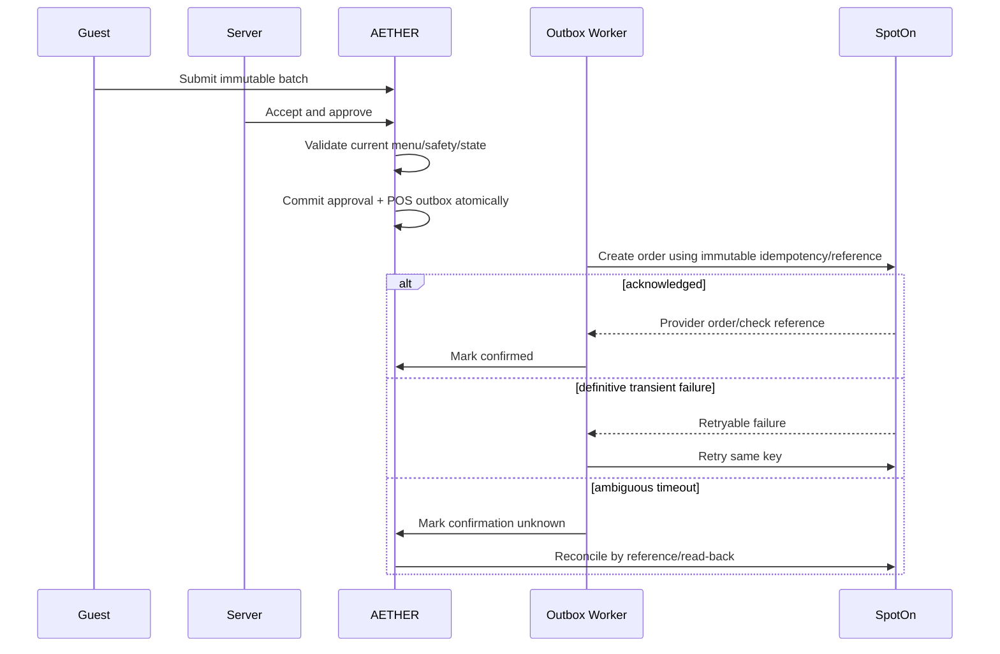

# SpotOn Restaurant Integration

Status: Approved architectural boundary; endpoint-level contract pending partner access.

## 1. Purpose

Integrate AETHER with AnTeNa’s SpotOn Restaurant (RPOS) account while keeping SpotOn authoritative for transactional menu data, accepted orders, kitchen routing, checks, and payments.

Official public documentation currently identifies SpotOn Centralized APIs as supporting RPOS and exposing menu read, order write, reporting reads, and menu/item/order-related webhooks. Exact access, payloads, certification, and capabilities must be confirmed through partner onboarding and sandbox tests.

Reference: [SpotOn Centralized API introduction](https://developers.spoton.com/central-api/docs/getting-started)

## 2. Ownership boundary

### SpotOn owns

- Merchant/location identifiers
- Item and modifier identifiers
- Prices, taxes, service charges, discounts, comps
- Availability
- Check/order records after acknowledgment
- Kitchen routing and coursing
- Payment and tip flow

### AETHER owns

- Enrichment, recommendation metadata, and menu presentation
- Dining sessions and temporary diner context
- Human approval workflow before POS submission
- Service requests
- Feedback and hospitality analytics
- Submission reliability/audit records

## 3. Required capabilities to validate

Before implementation is considered production-ready, sandbox contract tests must establish:

- OAuth authorization and token refresh behavior
- RPOS business/location identifiers
- Menu retrieval and pagination
- Stable item/modifier/category identifiers
- Item availability semantics and latency
- Nested modifier constraints
- Order creation and idempotency/reference behavior
- Table association and open-check lookup/creation
- Appending multiple order batches to one check
- Employee attribution
- Course metadata and routing behavior
- Order/check read-back for reconciliation
- Check/payment status availability
- Kitchen-status availability, if any
- Webhook signature, retry, replay, and event-ID behavior
- Rate limits, timeouts, and certification requirements

No unverified capability is launch-critical except reliable menu read, order write, and reconciliation.

## 4. Authentication

- Use official SpotOn OAuth.
- Store encrypted tokens only in server-side secret storage.
- Scope authorization per location.
- Never expose tokens to browser clients or tenant-readable rows.
- Rotate/revoke on offboarding or suspected compromise.
- Alert before token expiry or repeated refresh failure.

## 5. Menu synchronization

### Initial import

1. Fetch SpotOn menu for the authorized location.
2. Persist immutable raw/redacted snapshot for diagnosis.
3. Normalize categories, items, modifiers, constraints, prices, and availability.
4. Create/update stable mappings.
5. Create unpublished enrichment drafts for new items.
6. Flag changed/broken mappings for review.

### Ongoing updates

- Process verified menu and availability webhooks asynchronously.
- Apply availability restrictions immediately.
- Invalidate affected carts.
- Notify managers about structural/price/modifier changes.
- Poll incrementally during operating hours.
- Run full nightly reconciliation.
- Track sync cursor and freshness per location.

Names may suggest remapping candidates, but managers must confirm IDs and structure. Never guess.

## 6. Check linking

- Store manager-approved AETHER table ↔ SpotOn table mappings.
- At session start, query for an existing open check if supported.
- If multiple/ambiguous checks exist, require server selection.
- If no check exists, defer creation until first approved order unless SpotOn requires explicit earlier creation.
- One AETHER session maps to one SpotOn check in MVP.
- Split checks remain entirely in SpotOn.

## 7. Order submission

SpotOn must acknowledge successful creation before AETHER reports confirmation or proceeds.

## 8. Duplicate prevention

- Persist submission before sending.
- One immutable idempotency/reference key per approval group.
- Reuse the key for every retry.
- Record every attempt separately.
- On timeout, mark `confirmation_unknown`.
- Query/reconcile before any human resolution.
- Only a manager may resolve ambiguous absence.
- Never offer a generic “send again” action.

## 9. Employee attribution

Preferred: map the approving AETHER server to a SpotOn employee.

Fallback: use a dedicated SpotOn “AETHER” integration employee, if officially supported and configured, while retaining the approving server in AETHER audit records.

Missing mappings block approval unless the location is configured for the integration-employee mode.

## 10. Post-acceptance changes

AETHER does not mutate an accepted SpotOn order in MVP. Guests submit a service/clarification request; staff updates SpotOn directly. AETHER mirrors reliable resulting status.

## 11. Webhook handling

1. Read raw request body.
2. Verify official signature and timestamp once contract is known.
3. Reject stale/replayed requests.
4. Persist provider event and event ID.
5. Return promptly.
6. Process asynchronously and idempotently.
7. Record redacted outcome and correlation.

Never perform full synchronization in the webhook request.

## 12. Degraded mode

If SpotOn is unavailable:

- Continue cached menu browsing.
- Mark ordering unavailable.
- Direct guests to human service.
- Do not invisibly queue guest orders for later submission.
- Keep normal SpotOn/manual restaurant fallback independent from AETHER.

## 13. Certification checklist

- Partner approval received
- Sandbox credentials isolated
- OAuth flows verified
- Menu and modifier contract tests pass
- Order write/read-back passes
- Duplicate/timeout tests pass
- Webhook replay tests pass
- Rate-limit behavior tested
- Employee and table mapping validated
- Restaurant operational owner signs sample checks/tickets
- Production credentials provisioned only after approval

